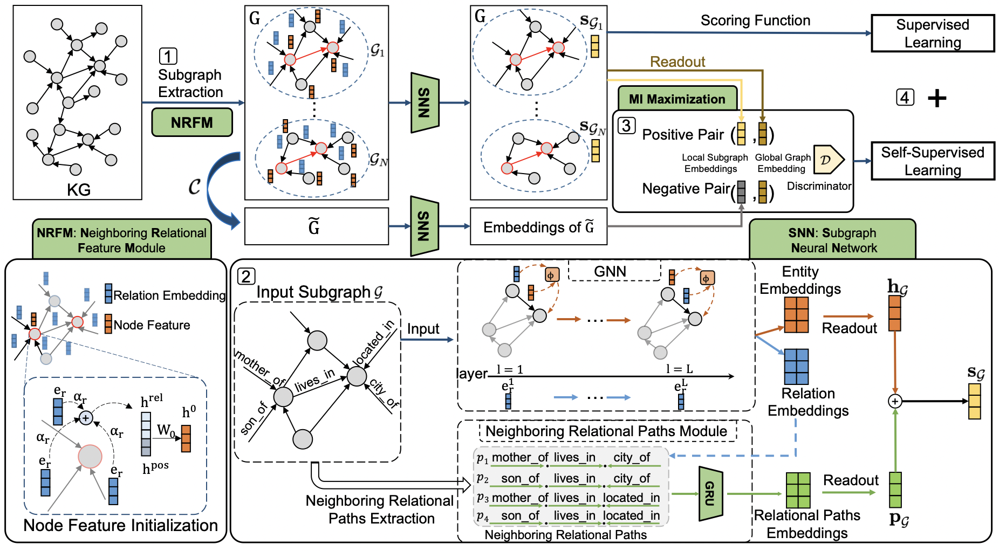

# SNRI - Subgraph Neighboring Relations Infomax for Inductive Link Prediction on Knowledge Graphs

Code for paper [Subgraph Neighboring Relations Infomax for Inductive Link Prediction on Knowledge Graphs](https://arxiv.org/abs/2208.00850) Xiaohan Xu, Peng Zhang, Yongquan He, Chengpeng Chao and Chaoyang Yan. IJCAI 2022.



Inductive link prediction for knowledge graph aims at predicting missing links between unseen entities, those not shown in training stage. Most previous works learn entity-specific embeddings of entities, which cannot handle unseen entities. Recent several methods utilize enclosing subgraph to obtain inductive ability. However, all these works only consider the enclosing part of subgraph without complete neighboring relations, which leads to the issue that partial neighboring relations are neglected, and sparse subgraphs are hard to be handled. To address that, we propose Subgraph Neighboring Relations Infomax, SNRI, which sufficiently exploits complete neighboring relations from two aspects: \textit{neighboring relational feature} for node feature and \textit{neighboring relational path} for sparse subgraph. To further model neighboring relations in a global way, we innovatively apply mutual information (MI) maximization for knowledge graph. Experiments show that SNRI outperforms existing state-of-art methods by a large margin on inductive link prediction task, and verify the effectiveness of exploring complete neighboring relations in a global way to characterize node features and reason on sparse subgraphs. 

## Requirements
    dgl==0.4.2
    lmdb==0.98
    networkx==2.4
    scikit-learn==0.22.1
    torch==1.4.0
    tqdm==4.43.0

## Usage

Train data and test data are located in `data` folder.

### Training

Train WN18RR dataset using the following commands:

```shell script
python train.py -d WN18RR_v1 -e snri_wn_v1
python train.py -d WN18RR_v2 -e snri_wn_v2
python train.py -d WN18RR_v3 -e snri_wn_v3
python train.py -d WN18RR_v4 -e snri_wn_v4
```

Train Fb15K237 dataset using the following commands:
```shell script
python train.py -d fb237_v1 -e snri_fb_v1
python train.py -d fb237_v2 -e snri_fb_v2
python train.py -d fb237_v3 -e snri_fb_v3
python train.py -d fb237_v4 -e snri_fb_v4
```

### Evaluation 

Evaluate model using similar commands like:
```shell script
python test_auc.py -d WN18RR_v4_ind -e snri_wn_v4
python test_ranking.py -d WN18RR_v4_ind -e snri_wn_v4
```

### Ablation Study

Run following commands for different variant models:
```shell script
python train.py -d WN18RR_v4 -e snri_wn_v4 --nei_rel_path # without neighboring relational path module
python train.py -d WN18RR_v4 -e snri_wn_v4 --init_nei_rels no  # without neighboring relational feature module
python train.py -d WN18RR_v4 -e snri_wn_v4 --coef_dgi_loss 0 # without MI module
```

## Citation 
If you use source codes included in this toolkit in your work, please cite the following paper. The bibtex are listed below:

    @inproceedings{ijcai2022p325,
      title     = {Subgraph Neighboring Relations Infomax for Inductive Link Prediction on Knowledge Graphs},
      author    = {Xu, Xiaohan and Zhang, Peng and He, Yongquan and Chao, Chengpeng and Yan, Chaoyang},
      booktitle = {Proceedings of the Thirty-First International Joint Conference on
                   Artificial Intelligence, {IJCAI-22}},
      publisher = {International Joint Conferences on Artificial Intelligence Organization},
      editor    = {Lud De Raedt},
      pages     = {2341--2347},
      year      = {2022},
      month     = {7},
      note      = {Main Track},
      doi       = {10.24963/ijcai.2022/325},
      url       = {https://doi.org/10.24963/ijcai.2022/325},
    }

## Acknowledgement
We refer to the code of [GraIL](https://github.com/kkteru/grail). Thanks for their contributions.
